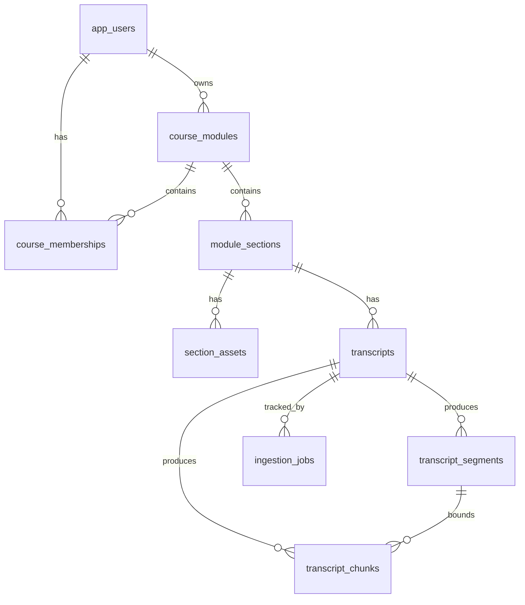

# CODEBASE_REVIEW.md — XYZ LMS

> **Location note.** The task template specified `CODEBASE_REVIEW.md` at repo root; the
> developer instruction overrode this to "save the report somewhere knowledge folder."
> This file therefore lives at `knowledge/CODEBASE_REVIEW.md`. File/line references inside
> this document are written as plain `path:line` (relative to repo root) for portability.
>
> **Evidence basis.** This review was performed against a live, healthy Docker stack
> (all six services up) on 2026-06-10. The database, backend tests, frontend type-check,
> OpenAPI schema, and embedding rows were inspected directly. Browser/Playwright gates were
> **not re-run this session** — their status is reported from prior session reports and is
> labelled accordingly. See §23 Verification Log for exactly what was and was not run.
>
> **Truth labels** used throughout: `IMPLEMENTED` · `CONFIGURED` · `PARTIAL` · `BROKEN` ·
> `MISSING` · `PLANNED` · `UNKNOWN`.

---

## 0. Executive Summary

XYZ LMS is an early-to-mid-stage learning-management system built as a **walking skeleton**
that has been verified vertically (browser → frontend → authenticated API → domain service →
DB/storage/worker → observable result) for its first four product stages. The implemented
product is: admin user/module/membership management, lecturer content management (sections,
PDF assets, publish/unpublish, notes), student published-only visibility with signed
download URLs, and a complete transcript ingestion pipeline (upload → parse → chunk → embed)
driven by Redis/RQ workers with 384-dim sentence-transformers embeddings persisted to
pgvector.

What is **only planned / not started**: quizzes, glossary, AI assistant, AI text generation
(summaries), progress, gamification, analytics, and the entire `platform/llm` and
`platform/events` infrastructure those depend on. There is **no LLM provider, prompt
registry, rate limiter, or AIRequestLog** in the codebase. "Embeddings" are produced by a
local sentence-transformers model, not an external LLM API.

What can be run: the full stack via `docker compose up`; backend tests pass (**193 passed**);
frontend type-checks clean (**exit 0**); migrations are at head (**0007**); the DB has the
expected 10 tables with pgvector 0.8.2 and pgcrypto installed.

There is **no `xyz-lms-final-roadmap-v2.md`** anywhere in the repository. `knowledge/STATUS.md`
is the authoritative status source and the per-stage `knowledge/specs|plans|steps` trios are
the per-stage authority. This is the single most important documentation gap for §9.

### Status table

| Area | Status | Evidence |
|---|---|---|
| Repo skeleton | IMPLEMENTED · verified | `docker-compose.yml`; `backend/`, `frontend/` present; Stage 1 FULLY VERIFIED in STATUS.md |
| Backend API (FastAPI) | IMPLEMENTED · verified | `backend/app/main.py:13-31`; 27 routes in `/openapi.json` |
| Database migrations | IMPLEMENTED · verified | `alembic current` → `0007 (head)`; 7 migrations in `backend/alembic/versions/` |
| Auth (Supabase JWT) | IMPLEMENTED · verified | `backend/app/platform/auth/jwt.py:35-47`; `test_auth.py` passes |
| Content management | IMPLEMENTED · verified | `backend/app/domains/content/service.py`; Stage 3 FULLY VERIFIED |
| Transcript upload | IMPLEMENTED · verified | `backend/app/domains/transcripts/service.py`; Stage 4.1 FULLY VERIFIED |
| Transcript parsing | IMPLEMENTED · verified | `backend/app/domains/transcripts/parse_service.py`; 25 segment rows |
| Transcript chunking | IMPLEMENTED · verified | `backend/app/domains/transcripts/chunk_service.py`; 7 chunk rows |
| Embeddings | IMPLEMENTED · verified | 3 chunks with 384-dim L2 vectors + full provenance (live DB query) |
| AI summaries / LLM | PLANNED · absent | no `platform/llm`; no LLM API calls in `backend/app` (grep clean) |
| Frontend app shell | IMPLEMENTED · verified | `frontend/src/lib/routing/ProtectedAppLayout.tsx`; type-check exit 0 |
| Generated API client | IMPLEMENTED · fresh | `frontend/src/lib/api/`; `scripts/generate-api-client.sh` |
| Browser gates | IMPLEMENTED · not re-run this session | 4 specs in `tests/e2e/`; last passing runs in STATUS.md |
| Backend tests | IMPLEMENTED · verified | `pytest` → **193 passed** (this session) |

### Biggest current gaps
1. **No roadmap file** in-repo — §9 stage mapping is reconstructed from STATUS.md + specs.
2. **No `platform/llm` / `platform/events`** — every AI/event-dependent stage is not started.
3. **Browser gates not re-run this session** — green status is inherited from prior reports.
4. **Frontend has zero unit tests** and uses inline styles only (no design system).
5. **Transcript parse/chunk recovery deferred** (Session 4.6) — crash/enqueue-failure states
   can leave stuck `uploaded`/`parsing`/`queued` rows (documented in STATUS.md "Known issues").

---

## 1. Repository Snapshot

| Field | Value |
|---|---|
| Repo root | `/Users/arthur.leontev/Desktop/LMS/test2` |
| Branch | `main` |
| Commit | `442f221` — "feat: generate transcript chunk embeddings" |
| Working tree | **clean** (`git status --porcelain` empty at review time) |
| Docker services | db, redis, backend, worker, embedding_worker, frontend — all running; db/redis/backend report healthy |
| Backend package manager | pip / `pyproject.toml` (editable install `.[dev]`) |
| Frontend package manager | npm / `package.json` |
| Python version | 3.12.13 (in backend container) |
| Node version | node:20-alpine (frontend image) |
| Database | PostgreSQL 16 (`pgvector/pgvector:pg16`), extensions: `vector` 0.8.2, `pgcrypto` 1.3 |
| Redis | `redis:7-alpine` (RQ broker); `PING` → `PONG` |
| OpenAPI | Served at `/openapi.json`; 27 operations |
| Generated frontend client | Present and checked in under `frontend/src/lib/api/` |

> **Note on the session-start git snapshot.** The harness captured a stale snapshot showing
> many modified/untracked files (the embedding work). At actual review time the tree is clean;
> all that work is committed at `442f221`. The review reflects the clean committed state.

Top-level folders: `backend/`, `frontend/`, `knowledge/`, `tests/`, `scripts/`, `prompts/`,
`supabase/`, `docker/`, plus root config (`docker-compose.yml`, `.env.example`,
`playwright.config.ts`, `AGENTS.md`, `README.md`).

---

## 2. System Purpose and Architecture

XYZ LMS is intended to let lecturers manage course modules and content, ingest lecture
transcripts, and (in planned future stages) generate AI summaries, quizzes, glossaries, and a
study assistant, while tracking student progress, gamification, and analytics. The codebase
today implements the foundation: identity/access, content, and the transcript→embedding
pipeline.

### Walking-skeleton chain (as implemented)
```
Browser (Next.js route, role-guarded)
  → SessionProvider attaches Supabase JWT
  → generated OpenAPI client (wrapper.ts) / upload.ts
  → FastAPI router (api/routers/*)
  → auth dependency validates JWT + loads AppUser + checks module access
  → domain service (domains/{admin,content,transcripts})
  → Postgres (SQLAlchemy async) / Supabase Storage / Redis(RQ) worker
  → observable result re-fetched in the browser
```
This chain is real for stages 1–4.4 and was proven end-to-end in browser gates 4.3.5b/c/d/e
and 4.4 (per STATUS.md). The transcript path additionally crosses the worker boundary:
upload enqueues `parse` → on success enqueues `chunk` → on success enqueues `embed`.

### Domain coverage vs intent
- **User roles**: admin / lecturer / student — IMPLEMENTED (`app_users.role`, JWT `role`).
- **Course modules + memberships**: IMPLEMENTED (`course_modules`, `course_memberships`).
- **Lecturer content management**: IMPLEMENTED (sections, assets, notes, publish).
- **Transcript pipeline**: IMPLEMENTED through embeddings.
- **AI infrastructure (LLM, prompts, summaries)**: PLANNED — not present.
- **Quiz / event spine (StudentActivityEvent)**: PLANNED — not present.
- **Progress / gamification / analytics**: PLANNED — not present.

---

## 3. Tech Stack

| Technology | Where configured | Where used | Status | Evidence |
|---|---|---|---|---|
| Python 3.12 | `backend/Dockerfile`, `pyproject.toml` | backend | IMPLEMENTED | `python --version` → 3.12.13 |
| FastAPI | `pyproject.toml` (`fastapi>=0.115`) | `backend/app/main.py` | IMPLEMENTED | 27 routes in OpenAPI |
| SQLAlchemy async | `pyproject.toml` (`sqlalchemy>=2.0`) | `platform/db/session.py:8-13` | IMPLEMENTED | `create_async_engine` |
| Alembic | `pyproject.toml` | `backend/alembic/` | IMPLEMENTED | `alembic current` → 0007 |
| PostgreSQL 16 | `docker-compose.yml` (db) | runtime | IMPLEMENTED | `\dt` 10 tables |
| pgvector | `docker/postgres/init/001-create-vector.sql`; migration 0006 | `transcript_chunks.embedding Vector(384)` | IMPLEMENTED | `\dx` → vector 0.8.2 |
| pgcrypto | init SQL | UUID/hashing support | CONFIGURED | `\dx` → pgcrypto 1.3 |
| Redis | `docker-compose.yml` (redis) | RQ broker | IMPLEMENTED | `redis-cli ping` → PONG |
| RQ | `pyproject.toml` (`rq>=2.0`) | `app/workers/*` | IMPLEMENTED | `worker.py`, `queues.py` |
| Supabase auth (JWT) | `config.py` SUPABASE_JWKS_URL etc. | `platform/auth/jwt.py` | IMPLEMENTED | `test_auth.py` |
| Supabase Storage | `config.py`; `platform/storage/supabase.py` | asset/transcript files | IMPLEMENTED | content/transcript tests |
| Cloudflare R2 / S3 | — | — | MISSING | no R2/S3 provider; only `SupabaseStorageProvider` |
| K2Think / IFM | — | — | MISSING | no references in `backend/app` |
| sentence-transformers | `pyproject.toml` (`>=3.3`) | `transcripts/embedding_encoder.py` | IMPLEMENTED | model all-MiniLM-L6-v2 |
| Next.js 15.3.3 | `frontend/package.json` | `frontend/src/app/*` | IMPLEMENTED | App Router routes |
| React 19.1 | `frontend/package.json` | frontend | IMPLEMENTED | — |
| TypeScript 5.8 | `frontend/tsconfig.json` | frontend | IMPLEMENTED | `tsc --noEmit` exit 0 |
| openapi-typescript-codegen 0.29 | `frontend/package.json` (dev) | `scripts/generate-api-client.sh` | IMPLEMENTED | generated `lib/api/` |
| Tailwind / styling system | — | — | MISSING | inline `React.CSSProperties` only |
| Playwright | root `playwright.config.ts`, root `package.json` | `tests/e2e/*.spec.ts` | IMPLEMENTED | 4 specs |
| pytest (+anyio) | `pyproject.toml` dev | `backend/tests/*` | IMPLEMENTED | 193 passed |
| Docker Compose | `docker-compose.yml`, `.e2e.yml` | runtime | IMPLEMENTED | `compose ps` |
| Railway/deploy config | — | — | MISSING | no deploy config found |
| LLM provider / LLM_API_KEY | `.env.example` (`LLM_API_KEY`, `LLM_PROVIDER_BASE_URL`) | nowhere in code | PLANNED | env vars exist; no consumer code |

---

## 4. Runtime and Deployment

Local runtime is Docker Compose only; there is no production/deploy config in-repo
(MISSING). Migrations are run manually (`docker compose exec backend alembic upgrade head`)
per `README.md`; they are not auto-run on backend boot (no startup hook in `main.py`).

### Service table (`docker-compose.yml`)

| Service | Image/build | Port | Depends on | Purpose | Health |
|---|---|---|---|---|---|
| db | `pgvector/pgvector:pg16` | 5432:5432 | — | Postgres + pgvector | `pg_isready` |
| redis | `redis:7-alpine` | 6379:6379 | — | RQ broker | `redis-cli ping` |
| backend | build `./backend` | 8000:8000 | db (healthy), redis (healthy) | FastAPI API | `curl /health` |
| worker | build `./backend` | — | db, redis (healthy) | generic RQ worker (`python -m app.workers.worker`) → `ingestion` queue | none |
| embedding_worker | build `./backend` | — | db, redis (healthy) | RQ worker (`python -m app.workers.worker embedding`) → `embedding` queue | none |
| frontend | build `./frontend` | 3000:3000 | backend (healthy) | Next.js dev server | none |

Startup sequence: db+redis become healthy → backend (after migrations are run) → frontend.
The two workers share the backend image but differ only by CLI arg selecting the queue
(`worker.py:27-34`, `queues.py:10-11`). Embeddings run on a dedicated worker so model loading
and concurrency (`EMBEDDING_WORKER_CONCURRENCY`) are isolated from parse/chunk jobs.

Health checks: `GET /health` (unauthenticated, `health.py:11-13`) and `GET /health/authed`
(`health.py:16-25`). Secrets vs config: see §24 Appendix D. The embedding model is **baked
into the backend image at build time** (`backend/Dockerfile`) at
`/opt/models/sentence-transformers/all-MiniLM-L6-v2`, pinned to revision
`1110a243fdf4706b3f48f1d95db1a4f5529b4d41`, so workers do not download at runtime.

`docker-compose.e2e.yml` overlays `.env.e2e` onto backend/worker/embedding_worker/frontend
for the Playwright stack.

---

## 5. Backend Architecture

### 5.1 Backend folder structure
```
backend/app/
  main.py            FastAPI app factory + router registration
  api/routers/       thin HTTP layer (health, me, admin, content, modules, transcripts)
  platform/          infrastructure: auth, db, query, storage, config, supabase_client
  domains/           write-owning business logic: admin, content, transcripts
  workers/           RQ worker entrypoint + queue/enqueue helpers
  ai/                present but minimal (see §5.5 / §14)
backend/alembic/     migrations 0001–0007
backend/tests/       pytest suite (15 files)
```
The intended principle (domains own writes; platform provides infrastructure; api layer
thin; `platform/query` is read-only) **holds** in the inspected code: routers delegate to
domain services and commit at the router edge (e.g. `admin.py:43`), reads route through
`platform/query/*`, and writes live in `domains/*`.

### 5.2 FastAPI application — `backend/app/main.py`
- App factory `create_app()` (`:13-28`), global `app` (`:31`), title "XYZ LMS".
- CORS middleware (`:15-21`): `allow_origins=settings.CORS_ORIGINS`, `allow_credentials=True`,
  methods/headers `*`. Origins parsed in `config.py:15-24` (default `http://localhost:3000`).
- Routers registered (`:22-27`): health, me, admin, content, modules, transcripts.
- **No** custom startup/shutdown hooks, **no** custom exception handlers, **no** custom
  OpenAPI config (FastAPI defaults). (Observation, not a defect.)

### 5.3 API routers — full endpoint inventory
(See §11 / Appendix B for the merged table; OpenAPI confirms all 27 operations.)

- **health** (`health.py`): `GET /health` (open), `GET /health/authed` (CurrentUser).
- **me** (`me.py:48-86`): `GET /me` → `CurrentUserResponse` with active memberships;
  admins get empty memberships (`:71-77`).
- **admin** (`admin.py`, prefix `/admin`, guarded by `require_role("admin")` `:27`):
  user CRUD + deactivate + reset-password; module create/list; member assign/list/remove.
  Supabase errors mapped to 409/400 (`:32-42`).
- **content** (`content.py`): section list/detail, asset list/upload/replace/download-url,
  notes PATCH, publish/unpublish. Uses `require_module_access` (`:40`).
- **modules** (`modules.py`): `GET /modules` (active for user), `GET /modules/{id}` (detail).
- **transcripts** (`transcripts.py`): upload, get active, processing-status. OperationIds
  `uploadSectionTranscript`, `getSectionTranscript`, `getSectionTranscriptProcessingStatus`.

### 5.4 Auth and authorization — `backend/app/platform/auth/`
- **JWT validation** (`jwt.py:35-47`): PyJWKClient against `SUPABASE_JWKS_URL`, RS256/ES256,
  audience `SUPABASE_JWT_AUDIENCE` (default `authenticated`), issuer `SUPABASE_JWT_ISSUER`,
  required claims `sub/exp/role`; failures → 401.
- **CurrentUserContext** (`context.py:14-22`): frozen dataclass (user_id, auth_provider_id,
  email, full_name, role, is_active, timezone).
- **App-user lookup + inactive handling** (`dependencies.py:24-52`): Bearer token → decode →
  load `AppUser` by `auth_provider_id`; **not found → 401** (`:35-36`); **inactive → 403**
  "Account is inactive" (`:38-42`). This is the key 401-vs-403 distinction.
- **Guards** (`guards.py`): `require_role(*roles)` → 403 on mismatch (`:14-27`);
  `require_module_access(...)` → 404 if no access, builds `ModuleAccessContext` with
  `can_publish` (`:30-53`). `can_publish` is role-derived (STATUS.md known issue).
- **Backend vs frontend protection**: the frontend route guard (§7.5) is UX only;
  authorization is enforced server-side at these dependencies. `GET /me` exists (`me.py`).

### 5.5 Platform layer
| Module | Purpose | Key items |
|---|---|---|
| `platform/auth/` | JWT + current-user + guards | `jwt.py`, `dependencies.py`, `context.py`, `guards.py` |
| `platform/db/` | async engine/session + ORM models | `session.py:8-21`; `models/*` (10 models) |
| `platform/query/` | read models | `modules.py`, `content_read.py`, `section_context.py`, `transcript_status.py` |
| `platform/storage/` | storage abstraction | `base.py:22-43` protocol; `supabase.py`; `keys.py` |
| `platform/config.py` | settings | `:9-146` typed settings + `SettingsError` |
| `platform/supabase_client.py` | Supabase admin client | auth ops for admin domain |

- **`platform/events` — MISSING.** No `StudentActivityEvent` anywhere.
- **`platform/llm` — MISSING.** No `LLMProvider`, `PromptRegistry`, `RateLimiter`, or
  `AIRequestLog`. The `backend/app/ai/` directory exists but contains no LLM provider
  abstraction (see §14). Do not treat AI infrastructure as present.
- **`platform/security`** as a distinct module — not present; security concerns live in
  `auth/` + validators.

### 5.6 Domain layer — `backend/app/domains/`

**admin/** — IMPLEMENTED. `service.py` (user/module/membership CRUD, Supabase user creation
with rollback `:103-126`); `section_generation.py` generates four default draft sections on
module creation (`Lecture 1/2`, `Lab 1`, `Assignment 1` per STATUS.md / ADR not-required);
`schemas.py`. Tables: `app_users`, `course_modules`, `course_memberships`, `module_sections`.
Authz: `require_role("admin")`. Tests: `test_admin.py`.

**content/** — IMPLEMENTED. `service.py` (section list/detail role-aware, asset
upload/replace/download-url, publish/unpublish, notes; lecturer-only modify via
`_get_assigned_lecturer_section` `:77-100`); `validators.py` (PDF + size). Tables:
`module_sections`, `section_assets`. Authz: ADR-011/012/013/014. Tests: `test_content.py`.

**transcripts/** — IMPLEMENTED through embeddings. Files: `service.py` (upload + enqueue),
`jobs.py:11-20` (RQ wrappers `parse/chunk/embed`), `parse_service.py`, `chunk_service.py`,
`embedding_service.py`, `embedding_encoder.py`, `chunker.py`, `parsers/` (router, vtt, txt,
speaker, timestamps, types), `validators.py`, `schemas.py`. Tables: `transcripts`,
`transcript_segments`, `transcript_chunks`, `ingestion_jobs`. Invariants: one active
transcript per section; idempotency keys per stage. Tests: `test_transcripts.py`,
`test_transcript_parsers.py`, `test_transcript_chunker.py`, `test_transcript_worker.py`,
`test_embedding_encoder.py`.

**Roadmap domains NOT started**: `quiz`, `glossary`, `assistant`, `progress`,
`gamification`, `analytics` — none present (NOT STARTED).

### 5.7 Workers and background jobs
- Entrypoint `workers/worker.py:15-24`: reads `REDIS_URL`, builds an RQ `Worker` on a queue
  chosen by argv (`_queue_name` `:27-34`). Queue names in `queues.py:10-11`
  (`ingestion`, `embedding`).
- Enqueue helpers (`queues.py`): `enqueue_parse_transcript` (`:28-31`),
  `enqueue_chunk_transcript` (`:34-37`), `enqueue_embed_transcript` (`:40-49`, retry max 3,
  intervals 30/120/300s).
- Job inventory:

| Job fn | Enqueued by | Performs | Writes | Retry/idempotency | Status |
|---|---|---|---|---|---|
| `parse_transcript` | `service.upload_transcript` | parse file → segments | `transcript_segments`, `ingestion_jobs` | idempotency_key; `on_conflict_do_nothing` | IMPLEMENTED |
| `chunk_transcript` | parse success | segments → chunks | `transcript_chunks`, `ingestion_jobs` | idempotency_key incl. versions | IMPLEMENTED |
| `embed_transcript` | chunk success | chunks → 384-dim vectors | `transcript_chunks.embedding(+provenance)`, `ingestion_jobs` | RQ retry 3×; one-active-embed partial index | IMPLEMENTED |

- Status transitions: `Transcript.status` uploaded→queued→parsing→chunking→embedding→
  completed/failed; `IngestionJob.status` queued→running→completed/failed.
- **Recovery gaps (deferred to 4.6, per STATUS.md)**: enqueue failure can leave `uploaded`;
  mid-parse/chunk crash can leave `parsing`/`running`/`queued`. PARTIAL by design.

### 5.8 Database access pattern — `platform/db/session.py`
- `create_async_engine(DATABASE_URL)` (`:8`); `async_sessionmaker(... expire_on_commit=False)`
  (`:9-13`); FastAPI dependency `get_db_session()` (`:16-21`) yields a session in an async
  context manager; routers commit at the edge.
- Real example (admin user create), evidence `domains/admin/service.py:103-126` +
  `api/routers/admin.py:37-44`:
  ```python
  # router
  user = await service.create_user(db, payload)
  await db.commit()
  return user
  # service (abridged)
  db.add(user)
  try:
      await db.flush()
  except IntegrityError:
      await db.rollback()
      await _delete_supabase_user(supabase_user_id)
      ...
  await db.refresh(user)
  ```
  Pattern: add → flush → rollback-on-IntegrityError → refresh → commit-at-router. Worker jobs
  additionally use pessimistic locking (`with_for_update`) when claiming jobs.

---

## 6. Database Schema

Source: **live DB inspection** on 2026-06-10 (`information_schema`, `pg_indexes`,
`pg_catalog`). High confidence.

### 6.1 Extensions
| extension | installed? | used by | evidence |
|---|---|---|---|
| `vector` (pgvector) 0.8.2 | yes | `transcript_chunks.embedding` | `\dx` |
| `pgcrypto` 1.3 | yes | hashing/UUID support | `\dx` |
| `plpgsql` 1.0 | yes (default) | — | `\dx` |

### 6.2 Tables (10 + `alembic_version`)
Row counts at review time: app_users 7, course_modules 29, module_sections 106,
section_assets 19, transcripts 7, transcript_segments 25, transcript_chunks 7,
ingestion_jobs 21, course_memberships 52.

**app_users** — id(uuid PK), auth_provider_id(text, **uniq**), email(text, **uniq**),
full_name, role(text), is_active(bool, default true), timezone(default 'UTC'),
created_at/updated_at. Created by 0002. Model `models/user.py`.

**course_modules** — id PK, title, description(null), owner_id→app_users, timezone,
starts_on/ends_on(date,null), is_active, timestamps. 0002. `models/course_module.py`.

**course_memberships** — id PK, user_id→app_users, module_id→course_modules, role, status
(default 'active'), archived_at(null), timestamps. Partial unique index
`ix_course_memberships_active_user_module (user_id, module_id) WHERE status='active'`
(one active membership per user/module). 0002.

**module_sections** — id PK, course_module_id→course_modules, title, type, order_index,
week_number(null), session_date(null), due_at(null), publish_status(default 'draft'),
lecturer_notes(null), status(default 'active'), archived_at(null), timestamps. Unique
`(course_module_id, order_index)`; indexes on `(module, publish_status)`, `(module, week)`,
`(module, session_date)`, partial on `due_at`. 0002.

**section_assets** — id PK, module_section_id→module_sections, storage_key(**uniq**),
file_name, mime_type, file_size(bigint), processing_status(default 'completed'),
uploaded_by_user_id→app_users, checksum_sha256(NOT NULL), timestamps. 0002 + 0003 (rename
file_url→storage_key, add checksum, default→'completed').

**transcripts** — id PK, module_section_id→module_sections, source_type(default
'manual_upload'), original_file_name, storage_key(**uniq**), mime_type, file_size, checksum,
language(null), status(default 'uploaded'), uploaded_by_user_id→app_users(null),
is_active(default true), superseded_at(null), timestamps. Partial unique
`uq_active_transcript_per_section (module_section_id) WHERE is_active=true`; index
`(status, created_at)`. 0004.

**transcript_segments** — id PK, transcript_id→transcripts (CASCADE), sequence_number,
start_ms/end_ms(bigint,null), speaker_name(null), text, created_at. Unique
`(transcript_id, sequence_number)`. 0005.

**ingestion_jobs** — id PK, transcript_id→transcripts (CASCADE), job_type, status(default
'queued'), idempotency_key(**uniq**), processor_version(null), attempts(default 0),
error_message(null), started_at/completed_at(null), result_metadata(jsonb, 0006),
timestamps. Index `(transcript_id, job_type)`; partial unique
`ingestion_jobs_one_active_embed_per_transcript (transcript_id, job_type) WHERE
job_type='embed' AND status IN ('queued','running')` (0007). 0005.

**transcript_chunks** — id PK, transcript_id→transcripts (CASCADE), chunk_index,
start/end_segment_id→transcript_segments, start/end_sequence_number, start/end_time(bigint,
null), text, token_count, token_count_method, normalization_version, chunking_version,
is_oversized(default false), **embedding `vector(384)` (null)**, embedding_model,
embedding_version, embedding_generated_at, embedding_model_revision, embedding_dimension,
embedding_normalization, embedding_input_hash, timestamps. Unique `(transcript_id,
chunk_index)`. Check `ck_transcript_chunks_embedding_provenance` (0007): embedding NULL OR
all 5 provenance fields present AND dimension=384 AND normalization='l2'. 0006 + 0007.

### 6.3 ERD


### 6.4 Schema patterns
UUID PKs throughout; `created_at/updated_at` timestamptz with `now()` defaults; soft state
via `status`/`is_active`/`archived_at` (not hard delete) for memberships/sections/transcripts;
JSONB for `ingestion_jobs.result_metadata`; pgvector column for embeddings with a CHECK-based
provenance contract; idempotency via `ingestion_jobs.idempotency_key`; one-active-record
enforced via **partial unique indexes** (active membership, active transcript, active embed
job). CASCADE deletes hang off `transcripts` (segments/chunks/jobs).

---

## 7. Frontend Architecture

### 7.1 Folder structure (`frontend/src/`)
`app/` (App Router pages/layouts), `components/` (`auth/` AccessDenied), `features/`
(`admin/`, `content/lecturer`, `content/student` via `student/`, `modules/`),
`lib/` (`api/` generated client + wrapper + upload, `session/`, `routing/`, `supabase/`,
`e2e/`), `types/` (`e2e.d.ts`).

### 7.2 Routes
| Route | File | Auth | Backend? | Status |
|---|---|---|---|---|
| `/` | `app/page.tsx` | yes | session check → role redirect | IMPLEMENTED |
| `/login` | `app/(auth)/login/page.tsx` | no | `api.me.get()` bootstrap | IMPLEMENTED |
| `/admin` | `app/(app)/admin/page.tsx` | admin | admin panels | IMPLEMENTED |
| `/lecturer` | `app/(app)/lecturer/page.tsx` | lecturer | assigned modules | IMPLEMENTED |
| `/lecturer/modules/[moduleId]` | `.../[moduleId]/page.tsx` | lecturer | module detail | IMPLEMENTED |
| `/student` | `app/(app)/student/page.tsx` | student | assigned modules | IMPLEMENTED |
| `/student/modules/[moduleId]` | `.../[moduleId]/page.tsx` | student | module detail | IMPLEMENTED |
| `/unauthorized` | `app/(app)/unauthorized/page.tsx` | yes | — | IMPLEMENTED |
| `/tracer` | — | — | — | **DELETED (confirmed absent)** |

`/tracer` and `NEXT_PUBLIC_TRACER_ENABLED` are confirmed gone (grep clean across
`frontend/src` and `.env.example`; removed in commit `fd510f1`).

### 7.3 Key components
- `SectionTranscriptControl.tsx` — VTT/TXT upload control; `api.transcripts.getActive` +
  `uploadTranscript()`; handles 404/409; inline styles.
- `TranscriptStatusBadge.tsx` — polls `getProcessingStatus` (2.5s, 60s timeout); terminal
  states `embedded`/`failed`; maps step→text.
- `LecturerModuleDetail.tsx` — orchestrates module + sections + assets; notes save; asset
  upload/replace; publish toggle; ForbiddenError handling.
- Admin: `AdminModulesPanel`, `AdminUsersPanel` + forms. Student: `StudentModuleDetail`,
  `StudentSectionView/List`.

### 7.4 API client layer
Generated by `openapi-typescript-codegen` into `frontend/src/lib/api/` (core/, services/,
models/). `wrapper.ts` exposes the `api` facade and sets `OpenAPI.TOKEN` to an async resolver
calling Supabase `getSession()` (with an E2E forced-token override gated by
`NEXT_PUBLIC_E2E_TEST_HOOKS`). `withAuthRecovery()` maps 401→login redirect+`AuthRequiredError`
and 403→`ForbiddenError`. `upload.ts` is the sanctioned multipart helper (`uploadSectionAsset`,
`replaceSectionAsset`, `uploadTranscript`) attaching `Authorization: Bearer` manually.

**Direct fetch audit** (repo-level grep, this session): exactly **two** `fetch(` call sites —
`lib/api/core/request.ts:219` (generated client) and `lib/api/upload.ts:123` (sanctioned
upload helper). **Zero violations**, zero `axios`. Token attached via `OpenAPI.TOKEN`
(core/request.ts) and via `getBearerToken()` in `upload.ts`.

### 7.5 Frontend auth integration
Supabase browser client `lib/supabase/client.ts` (persistSession, autoRefreshToken).
`lib/session/SessionProvider.tsx` bootstraps via `api.me.get()` after a Supabase session is
found; states `loading/unauthenticated/authenticated/forbidden`; listens to `SIGNED_OUT`/
`TOKEN_REFRESHED`/`SIGNED_IN`. `ProtectedAppLayout.tsx` enforces role-prefix routing
(`/admin|/lecturer|/student`) and redirects mismatches to `/unauthorized` (UX-layer only;
real authz is server-side). Logout from `AppShell` → `supabase.auth.signOut()` → redirect.

### 7.6 Styling and design system
**No design system.** No Tailwind, no CSS modules, no global stylesheet, no component
library — every component uses inline `React.CSSProperties`. ARIA usage is present
(`role="status"`, `aria-live`, `aria-label`). UI maturity: functional internal-tool grade.

### 7.7 Frontend testing
Type-check only (`tsc --noEmit`, exit 0 this session). **No unit/integration tests** in
`frontend/src` (no Jest/Vitest). Browser coverage is the root Playwright suite
(`tests/e2e/*.spec.ts`, 4 specs) using real Supabase + backend + DB fixtures
(`tests/e2e/fixtures/db.mjs`) and E2E window hooks.

---

## 8. Cross-Cutting Architecture Rules

| Rule | Status | Evidence / Notes |
|---|---|---|
| Domains own writes | FOLLOWED | writes in `domains/*`, commit at router |
| `platform/query` read-only | FOLLOWED | `platform/query/*` are selects |
| API layer thin | FOLLOWED | routers delegate to services |
| Generated client authoritative | FOLLOWED | `lib/api/` generated; `scripts/generate-api-client.sh` |
| No direct fetch outside wrapper/upload | FOLLOWED | only 2 sanctioned fetch sites |
| Supabase login + backend JWT validation | FOLLOWED | `SessionProvider` + `auth/jwt.py` |
| GET /me bootstrap | FOLLOWED | `me.py` + `SessionProvider` |
| 401 vs 403 handled differently | FOLLOWED | `dependencies.py:35-42`; `wrapper.ts` |
| AI calls only through LLMProvider | NOT APPLICABLE YET | no LLM in repo |
| AIRequestLog before first K2Think call | NOT APPLICABLE YET | no AIRequestLog, no K2Think |
| StudentActivityEvent in platform/events | PLANNED / NOT APPLICABLE YET | `platform/events` MISSING |
| Event insert atomic with source action | NOT APPLICABLE YET | no events |
| TranscriptSegment.text never mutated | FOLLOWED (by design) | segments written once; chunk/embed read-only of text |
| Raw transcript hidden from students | FOLLOWED | no student transcript text DTO (STATUS gate 4.3.5e) |
| Storage abstraction used for files | FOLLOWED | `StorageProvider` protocol; Supabase impl |

---

## 9. Stage Status vs Roadmap

> **Critical gap:** there is **no `xyz-lms-final-roadmap-v2.md`** in the repository. The
> stage vocabulary below is reconstructed from `knowledge/STATUS.md`, `knowledge/log.md`, and
> the `knowledge/specs|plans|steps/stage-NN/*` trios. Where the roadmap's expected status is
> unknown, it is marked UNKNOWN.

| Stage | Roadmap expected | Actual repo status | Backend | Frontend | Tests | Browser gate | Evidence |
|---|---|---|---|---|---|---|---|
| 1 (skeleton/health) | UNKNOWN | FULLY VERIFIED | ✓ | ✓ | ✓ | passing (1.1b) | STATUS.md |
| 2 (identity/access) | UNKNOWN | FULLY VERIFIED | ✓ | ✓ | ✓ | passing (4.3.5c) | STATUS.md |
| 3 (content/visibility) | UNKNOWN | FULLY VERIFIED | ✓ | ✓ | ✓ | passing (4.3.5d E+E2-B1) | STATUS.md |
| 4.1 (transcript upload) | UNKNOWN | FULLY VERIFIED | ✓ | ✓ | ✓ | passing (4.3.5e) | STATUS.md |
| 4.2 (parse/segments) | UNKNOWN | FULLY VERIFIED | ✓ | ✓ | ✓ | passing (4.3.5e) | 25 segment rows |
| 4.3 (chunking) | UNKNOWN | FULLY VERIFIED | ✓ | ✓ | ✓ | passing (4.3.5e) | 7 chunk rows |
| 4.3.5 (client-edge recovery) | recovery block | COMPLETE | ✓ | ✓ | ✓ | passing | STATUS.md |
| 4.4 (embeddings) | UNKNOWN | FULLY VERIFIED | ✓ | ✓ | ✓ | passing (4.4) | 3 embedded chunks (live) |
| 4.5 (AIRequestLog + summaries) | next up | NOT STARTED | ✗ | ✗ | ✗ | — | STATUS "Next up"; no code |
| 4.6 (transcript recovery) | deferred | NOT STARTED | ✗ | — | ✗ | — | STATUS known issues |
| 4.7 (chunk/summary surfaces) | future | NOT STARTED | ✗ | ✗ | ✗ | — | STATUS known issues |
| 5–12 (quiz, glossary, assistant, progress, gamification, analytics, …) | UNKNOWN | NOT STARTED | ✗ | ✗ | ✗ | — | no domains present |

Browser-gate status above is **inherited from prior session reports**, not re-executed this
session (see §23).

### 9.1 Client Edge Recovery Block (4.3.5)
This block existed because stages 1–4.3 had been verified at the API/test level but lacked
*browser* proof. Sessions 4.3.5a–4.3.5e backfilled real browser gates: 4.3.5a built a
throwaway `/tracer` route to prove the Supabase-login→backend→DB→storage chain in a real
browser; 4.3.5b proved app-shell role routing + token refresh + 401 recovery; 4.3.5c proved
Stage 2 admin UI; 4.3.5d proved Stage 3 content UI (incl. signed-URL revocation repair
E2-B1); 4.3.5e proved Stage 4.1–4.3 transcript UI and then **deleted `/tracer`** and removed
`NEXT_PUBLIC_TRACER_ENABLED`. The repo currently contains the recovery work and `/tracer` is
gone (confirmed). Real product UI replaced the tracer.

### 9.2 Built vs Missing (representative)
**Stage 4.4 — Embeddings.** Backend: IMPLEMENTED (`embedding_service.py`, `embedding_encoder.py`).
Frontend: status badge surfaces `embedded`. DB: 3 chunks carry 384-dim L2 vectors with full
provenance (live query). Worker: dedicated `embedding_worker`. Tests: `test_embedding_encoder.py`
+ worker tests (193 passed). Browser gate: passed on run `e2e-1781089037-4-4-final` (per
STATUS), not re-run here. Status: FULLY VERIFIED. Gaps: none for this stage; downstream
summary surfaces not built.

**Stage 4.5 — AIRequestLog + summaries.** Backend: the worker function does **not** exist; no
`AIRequestLog` table, no `LLMProvider`. The login page wires nothing AI. Status: NOT STARTED.

---

## 10. End-to-End Flows

### 10.1 Health — REAL
`/` and health endpoints exist; Stage 1 gate proved a direct browser call to
`http://localhost:8000/health` with CORS header. `GET /health` returns
`{"status":"ok","service":"xyz-lms-backend"}` (verified this session).

### 10.2 Auth bootstrap — REAL
Supabase login → access token → `Authorization: Bearer` → backend JWT validation → `GET /me`
→ role + active memberships (`SessionProvider` + `me.py`).

### 10.3 Admin user/module flow — REAL
Admin creates users (Supabase + `app_users`), creates modules (auto-generates 4 draft
sections), assigns memberships; lecturer/student then see assigned modules (gate 4.3.5c).

### 10.4 Lecturer content flow — REAL
Lecturer opens assigned module → uploads PDF (`upload.ts`→content router→Supabase Storage +
`section_assets`) → publishes section → student sees published content + signed download URL
(gate 4.3.5d / E2-B1).

### 10.5 Transcript flow — REAL through embeddings
Lecturer uploads VTT/TXT → raw private storage + `transcripts` row → `parse` worker →
`transcript_segments` → `chunk` worker → `transcript_chunks` → `embed` worker → 384-dim
vectors. Status polled via processing-status endpoint. Proven in gate 4.3.5e + 4.4.

### 10.6 Summary/AI flow — PLANNED (not implemented)
`chunk → embedding → AIRequestLog → LLMProvider → summary stored → visible` — only the
`chunk → embedding` prefix exists. The rest is PLANNED.

### 10.7 Student learning flow — PARTIAL
Implemented: student opens assigned module, sees published sections/notes/assets, opens PDFs
via signed URL. PLANNED: read summary, take quiz, record mistake/event, progress/gamification.

---

## 11. API Contract Review

All 27 backend operations appear in `/openapi.json` (verified this session) and the generated
client mirrors them (`lib/api/services/*`). The frontend `api` facade + `upload.ts` consume
them. No drift detected: backend endpoints all have generated-client counterparts; the
working tree is clean so the committed client matches the served schema.

| Endpoint (method) | In OpenAPI | Frontend uses | Auth enforced | Tested |
|---|---|---|---|---|
| GET /health, /health/authed | ✓ | health gate | open / CurrentUser | test_health |
| GET /me | ✓ | SessionProvider | CurrentUser | test_me |
| /admin/* (10) | ✓ | admin panels | require_role admin | test_admin |
| /modules, /modules/{id} | ✓ | modules lists/detail | CurrentUser/ModuleAccess | test_modules |
| /modules/{id}/sections* (content, 9) | ✓ | lecturer/student detail | ModuleAccess + lecturer guard | test_content |
| /…/transcript (3) | ✓ | transcript control/badge | CurrentUser | test_transcripts |

Upload/replace/transcript-upload use multipart and are served by content/transcripts routers
but invoked through `upload.ts` (not the generated client's typed call) — by design, the
sanctioned exception.

---

## 12. Security and Authorization Review

- **Auth entrypoint**: every protected route depends on `get_current_user` which validates
  the Supabase JWT (JWKS, RS256/ES256, aud/iss/exp) and loads the `AppUser`.
- **Role enforcement**: `require_role("admin")` on all `/admin/*`; content mutation gated to
  the assigned lecturer (`_get_assigned_lecturer_section`).
- **Membership enforcement**: `require_module_access` resolves DB membership (ADR-003);
  module detail/sections require access.
- **Inactive users**: fresh login and reloaded session both denied (403) — proven in gate
  4.3.5c and `dependencies.py:38-42`.
- **Student boundaries**: students see only published sections; raw transcript text and
  chunk text are not exposed via any DTO (STATUS 4.3.5e gate; "no student transcript text
  surface: PROVEN"). Negative tests: student upload/transcript → 403 while session kept.
- **Storage**: private bucket (ADR-008); signed read URLs with TTL
  (`SIGNED_READ_URL_TTL_SECONDS`, default 300); unpublish blocks **future** URL minting but
  already-issued URLs remain valid until expiry (STATUS known issue).
- **Upload validation**: PDF + size for assets (`content/validators.py`); VTT/TXT + size for
  transcripts (`transcripts/validators.py`).
- **CORS**: explicit allow-list from `CORS_ORIGINS`.
- **Secrets**: typed settings; no values logged. **Frontend-only protection risk**:
  role-prefix routing is UX; server-side guards are the real boundary (and are present).
- Negative-authz tests exist in `test_admin.py`/`test_content.py`/`test_transcripts.py`.

---

## 13. File Upload and Storage Review

Storage abstraction `platform/storage/base.py:22-43` (`put/get/delete/create_signed_read_url`)
with a single `SupabaseStorageProvider` implementation (`supabase.py`). No local/dev or R2/S3
provider (MISSING). Keys generated by `storage/keys.py`; assets enforce unique `storage_key`.

| Upload type | Exists | Path |
|---|---|---|
| PDF section asset | IMPLEMENTED | POST/PUT `/…/assets`; `upload.ts` + content service; PDF+size validated |
| Transcript VTT/TXT | IMPLEMENTED | POST `/…/transcript`; `upload.ts:uploadTranscript`; private object |
| Other | MISSING | — |

Replace is in-place (ADR-007). Cleanup-failure can orphan private objects until a future
reconciliation job (STATUS known issue). E2E teardown must clean exact returned keys only.

---

## 14. AI / LLM / Embedding Review

**LLM infrastructure: ABSENT.** Repo-level grep over `backend/app` for
`openai|k2think|chat.completions|requests.post|httpx|anthropic` returns **no matches** this
session. There is no `LLMProvider`, `PromptRegistry`, `RateLimiter`, or `AIRequestLog`. The
`backend/app/ai/` directory and root `prompts/` exist but contain no wired LLM provider.
`.env.example` defines `LLM_PROVIDER_BASE_URL` and `LLM_API_KEY` but **no code consumes them**
(PLANNED).

**Embeddings: IMPLEMENTED (local model, not an LLM API).**
- `embedding_encoder.py`: `SentenceTransformersEmbeddingEncoder` loads
  `sentence-transformers/all-MiniLM-L6-v2`, 384-dim, L2-normalized (`normalize_embeddings=True`),
  CPU; validates dim/finite/‖v‖≈1; `DeterministicEmbeddingEncoder` is a test fallback. The
  only ML import is `from sentence_transformers import SentenceTransformer` (dynamic).
- `embedding_service.py`: claims the embed `ingestion_job`, batches stale chunks
  (`EMBEDDING_BATCH_SIZE`), persists vectors + provenance, marks job/transcript completed;
  idempotency via input-hash + per-version idempotency key; one-active-embed partial index.
- DB proof (live): chunks carry `embedding_model=sentence-transformers/all-MiniLM-L6-v2`,
  `dimension=384`, `normalization=l2`, `version=embedding-v1`, `vector_dims(embedding)=384`,
  `embedding_generated_at` set.

Classification: embeddings = **Implemented locally**; all LLM/text-generation = **Planned only**.

---

## 15. Testing Review

Backend `pytest` this session: **193 passed, 83 warnings** (the known `httpx` ASGI-shortcut
deprecation). Files (`backend/tests/`): `conftest.py` (async DB fixtures, truncation), and
test modules for admin, auth, config, content, db_spine (schema/migration chain),
embedding_encoder, health, me, modules, storage_supabase, transcript_chunker,
transcript_parsers, transcript_worker, transcripts.

Frontend: `tsc --noEmit` exit 0; **no unit tests**.

E2E (`tests/e2e/`): `4.3.5b-shell-routing`, `4.3.5c-stage2-admin`, `4.3.5e-transcript`,
`4.4-embedding-browser`. Real Supabase/backend/DB via `fixtures/db.mjs` + window hooks.
**Not re-run this session.**

| Feature | Backend tests | Frontend tests | Browser tests | Notes |
|---|---|---|---|---|
| Auth/me | ✓ | none | ✓ (4.3.5b) | not re-run here |
| Admin | ✓ | none | ✓ (4.3.5c) | |
| Content | ✓ | none | ✓ (4.3.5d) | spec lives in archive/history; gate proven |
| Transcript pipeline | ✓ | none | ✓ (4.3.5e) | |
| Embeddings | ✓ | none | ✓ (4.4) | |

---

## 16. Running the Project

| Step | Command | Expected | Observed this session |
|---|---|---|---|
| 1 Clone | — | repo | n/a |
| 2 Env | `cp .env.example .env` | `.env` present | `.env` already present |
| 3 Start | `docker compose up` | 6 services | all 6 up (db/redis/backend healthy) |
| 4 Migrate | `docker compose exec backend alembic upgrade head` | head 0007 | `alembic current` → 0007 |
| 5 Gen client | `bash scripts/generate-api-client.sh` | client regen (needs backend up) | not run (tree clean → client fresh) |
| 6 Tests | `docker compose exec backend pytest` | pass | **193 passed** |
| 7 Frontend | open `http://localhost:3000` | app shell | service up (not browser-opened here) |
| 8 Health | `curl http://localhost:8000/health` | `{"status":"ok",...}` | confirmed |
| 9 Logs | `docker compose logs <svc>` | logs | n/a |

Common failures: missing `.env` (backend `SettingsError`); migrations not applied (DB errors);
backend not up before client generation (script fetches `/openapi.json`).

---

## 17. Debugging Guide

General: `docker compose logs -f backend|frontend|worker|embedding_worker`,
`docker compose exec backend bash`, `docker compose exec db psql -U postgres -d xyz_lms`,
`docker compose exec redis redis-cli`.

| Symptom | Likely cause | Inspect | Commands |
|---|---|---|---|
| Backend won't start | missing/invalid env | `config.py`, `.env` | `docker compose logs backend` |
| Frontend can't reach backend | CORS / `NEXT_PUBLIC_API_BASE_URL` | `main.py:15-21`, wrapper.ts | check `Access-Control-Allow-Origin` |
| JWT validation fails | JWKS/issuer mismatch | `auth/jwt.py`, env | decode token, compare iss/aud |
| User gets 401 | bad token / user not in `app_users` | `dependencies.py:35-36` | query `app_users` by auth_provider_id |
| User gets 403 | inactive user or role/membership | `dependencies.py:38-42`, guards | check `is_active`, `course_memberships` |
| Migrations fail | extension/preflight | `0006`,`0007`, init SQL | `alembic current/heads` |
| Worker not processing | wrong queue / Redis down | `queues.py`, `worker.py` | `redis-cli ping`; `logs worker` |
| Upload fails | size/type / storage creds | validators, storage/supabase | `logs backend` |
| Storage URL fails | TTL expired / unpublished | signed-url endpoint, ADR-013/022 | re-mint URL |
| Transcript stuck `parsing`/`uploaded` | enqueue/crash (4.6 deferred) | parse/chunk services | inspect `ingestion_jobs` |
| Client stale | schema changed, not regenerated | `scripts/generate-api-client.sh` | rerun + `git diff lib/api` |

---

## 18. Development Workflow and Knowledge System

Workflow (authoritative in `knowledge/dev-workflow.md`): **spec → plan → build → verify →
report → close-the-loop**. One session = a linked trio
`specs/stage-NN/<s>.md` / `plans/stage-NN/<s>.md` / `steps/stage-NN/<s>.md`, cross-linked by
frontmatter + Obsidian wikilinks. Cross-cutting files: `STATUS.md` (overwrite each session),
`log.md` (append one line), `open-questions.md`, `architecture/` (only on source-path
change), `decisions/` (one ADR per durable decision; 003–024 present). **Sacred rule: code
wins over docs.** An agent should read `AGENTS.md` → `STATUS.md` → relevant spec before coding.

---

## 19. Key Files and Entry Points

- **Add an API endpoint** → start `backend/app/api/routers/<area>.py`; read an existing
  router + `domains/<area>/service.py`; example: `content.py` publish endpoint; tests in
  `test_content.py`; regenerate client (`scripts/generate-api-client.sh`). Trap: commit at
  router, not in service.
- **Add a table** → new `backend/alembic/versions/000N_*.py` + `platform/db/models/*.py`;
  example migration `0005`/`0006`; add to `test_db_spine.py`. Trap: extensions/preflight
  (see `0006`/`0007`).
- **Add a frontend page** → `frontend/src/app/(app)/<role>/.../page.tsx`; read
  `LecturerModuleDetail.tsx`; call via `api`/`upload.ts`; type-check. Trap: no direct fetch.
- **Understand auth** → `platform/auth/*` + `SessionProvider.tsx`; runtime: JWT→AppUser→guards.
- **Understand transcripts** → `domains/transcripts/*`; worker `workers/*`; tables
  `transcripts/segments/chunks/ingestion_jobs`.
- **Understand storage** → `platform/storage/*`; ADR-005/008/013/022.
- **Understand workers** → `workers/worker.py` + `queues.py`.
- **Understand AI** → not present; `prompts/` + `backend/app/ai/` are placeholders. Hard rule
  for future: route LLM calls through a `platform/llm` provider with `AIRequestLog` before the
  first external call.

---

## 20. Critical Files

| Path | Why it matters | Defines | If removed |
|---|---|---|---|
| `backend/app/main.py` | app + CORS + routers | FastAPI app | API down |
| `backend/app/platform/auth/dependencies.py` | the auth boundary | current-user + 401/403 | all auth broken |
| `backend/app/platform/db/session.py` | DB access | async engine/session | no DB |
| `backend/app/platform/storage/supabase.py` | file I/O | storage provider | uploads broken |
| `backend/app/workers/queues.py` | job wiring | enqueue + queue names | pipeline stalls |
| `backend/alembic/versions/000*.py` | schema source | tables/constraints | schema drift |
| `frontend/src/lib/api/wrapper.ts` | client + auth recovery | `api` facade | frontend API broken |
| `frontend/src/lib/api/upload.ts` | multipart uploads | upload helpers | uploads broken |
| `frontend/src/lib/session/SessionProvider.tsx` | auth state | bootstrap/role | no session |
| `docker-compose.yml` | runtime | services | can't run locally |
| `.env.example` | config contract | env var names | setup unclear |
| `knowledge/STATUS.md` | authoritative status | current state | lose ground truth |

---

## 21. Extending the System

### 21.1 Add a backend endpoint
Touch router (`api/routers/<area>.py`) + service (`domains/<area>/service.py`) + schema.
Use `CurrentUser`/`require_role`/`require_module_access` deps; commit at router; add a pytest;
regenerate the client. Template: any `content.py` action.

### 21.2 Add a database table
New numbered migration (follow `0005`/`0006` style) with `upgrade`/`downgrade`, constraints,
indexes; matching SQLAlchemy model in `platform/db/models/`; assert in `test_db_spine.py`.
Mind the embedding-style preflight pattern (`0007`) for risky changes.

### 21.3 Add a frontend page
New route under `app/(app)/<role>/`; client component pattern like `LecturerModuleDetail`;
call backend through `api`/`upload.ts`; handle loading/error/Forbidden; `tsc --noEmit`.

### 21.4 Add a worker job
Add job fn in `domains/.../jobs.py`, enqueue helper in `workers/queues.py`, an
`ingestion_jobs` row with an idempotency key, retry config; test in `test_transcript_worker.py`
style.

### 21.5 Add an AI feature
**Infrastructure does not exist yet.** Required path before any external call:
`LLMProvider → PromptRegistry → RateLimiter → AIRequestLog → OutputValidator`. Hard rule: no
direct model calls from feature services; `AIRequestLog` + write path must exist before the
first K2Think/LLM call.

---

## 22. Findings and Gaps

| ID | Sev | Area | Finding | Evidence | Impact | Status |
|---|---|---|---|---|---|---|
| F-001 | High | Docs | No `xyz-lms-final-roadmap-v2.md` in repo; stage mapping relies on STATUS.md/specs | repo-wide find returns nothing | §9 cannot be validated against an authoritative roadmap | Open |
| F-002 | Info | AI | No `platform/llm`/`platform/events`; `LLM_API_KEY` env unused | grep clean; `.env.example` | AI/event stages (4.5+) not started | Open (expected) |
| F-003 | Medium | Frontend | Zero frontend unit tests; inline styles only | `frontend/` tree | regressions rely solely on e2e + type-check | Open |
| F-004 | Medium | Workers | Transcript parse/chunk recovery deferred (4.6) | STATUS known issues | crash/enqueue-failure leaves stuck rows | Open (deferred) |
| F-005 | Low | Security | Issued signed URLs valid until TTL after unpublish | STATUS known issues; ADR-013 | brief post-unpublish access window | Open (accepted) |
| F-006 | Low | Ops | Hosted Postgres extension bootstrap not in init for hosted deploy | STATUS known issues | first hosted deploy must create `vector`/`pgcrypto` | Open |
| F-007 | Low | Storage | No R2/S3 provider; only Supabase | `storage/` | hosting tied to Supabase Storage | Open |
| F-008 | Low | DX | No generate script in `frontend/package.json`; generation only via root `scripts/` | `package.json` | client regen is a manual root step | Open |
| F-009 | Info | Tests | Persistent `httpx` ASGI-shortcut deprecation warning | pytest output | cosmetic; future httpx break risk | Open |

No source code was changed; all findings are documentation/observation only.

---

## 23. Verification Log

| Command | Result | Output summary |
|---|---|---|
| `git rev-parse --short HEAD` / branch / `status --porcelain` | PASS | `442f221`, `main`, **clean** |
| `docker compose ps` | PASS | 6 services up; db/redis/backend healthy |
| `docker compose exec backend python --version` | PASS | 3.12.13 |
| `docker compose exec backend alembic current` / `heads` | PASS | `0007 (head)` both |
| `curl /health` | PASS | `{"status":"ok","service":"xyz-lms-backend"}` |
| `curl /openapi.json` (paths) | PASS | 27 operations enumerated |
| `docker compose exec backend pytest -q` | PASS | **193 passed, 83 warnings** |
| `docker compose exec frontend npx tsc --noEmit` | PASS | exit 0 |
| `psql \dt` / `\dx` | PASS | 10 tables; vector 0.8.2, pgcrypto 1.3 |
| `psql` columns/constraints/indexes/counts | PASS | full schema captured (§6) |
| `psql` embedded-chunk proof | PASS | 3 chunks, 384-dim L2, full provenance |
| `redis-cli ping` | PASS | PONG |
| grep direct-fetch (frontend) | PASS | only `core/request.ts:219`, `upload.ts:123` |
| grep tracer refs | PASS | none (confirmed deleted) |
| grep LLM/http (backend) | PASS | no matches (no LLM calls) |
| Playwright e2e suite | **SKIPPED** | not run this session; requires `.env.e2e` stack; last passing runs documented in STATUS.md |
| `scripts/generate-api-client.sh` | **SKIPPED** | tree clean → client already fresh; not re-run to avoid touching files |

---

## 24. Appendices

### Appendix A — File Inventory (meaningful areas)
- **Backend source** (`backend/app/`): `main.py`; `api/routers/{health,me,admin,content,modules,transcripts}.py`;
  `platform/{auth,db,query,storage}/*`, `platform/config.py`, `platform/supabase_client.py`;
  `domains/{admin,content,transcripts}/*`; `workers/{worker,queues}.py`; `ai/` (placeholder).
- **Migrations** (`backend/alembic/versions/`): `0001_baseline` … `0007_embedding_schema_preflight` (7).
- **Backend tests** (`backend/tests/`): 15 files (§15).
- **Frontend source** (`frontend/src/`): `app/*` routes; `features/*`; `lib/{api,session,routing,supabase,e2e}/*`;
  `components/auth/*`; `types/e2e.d.ts`.
- **Generated** (`frontend/src/lib/api/`): `core/`, `services/` (6), `models/` (~27) — generated by
  `openapi-typescript-codegen`; regenerate via `scripts/generate-api-client.sh`.
- **E2E** (`tests/e2e/`): 4 specs + `fixtures/db.mjs`; `playwright.config.ts`.
- **Docs** (`knowledge/`): STATUS, log, dev-workflow, open-questions; `specs/`, `plans/`, `steps/`,
  `architecture/`, `decisions/` (ADR 003–024), `archive/`, `templates/`.
- **Config**: `docker-compose.yml`, `docker-compose.e2e.yml`, `backend/Dockerfile`,
  `frontend/Dockerfile`, `docker/postgres/init/001-create-vector.sql`, `.env.example`,
  `.env.e2e.example`, `pyproject.toml`, `package.json`.

### Appendix B — Endpoint Inventory
27 operations (from `/openapi.json`): `/health`, `/health/authed`, `/me`; `/admin/users`(POST/GET),
`/admin/users/{id}`(GET), `/admin/users/{id}/deactivate`(POST), `/admin/users/{id}/reset-password`(POST),
`/admin/modules`(POST/GET), `/admin/modules/{id}/members`(POST/GET),
`/admin/modules/{id}/members/{uid}`(DELETE); `/modules`(GET), `/modules/{id}`(GET);
`/modules/{id}/sections`(GET), `/…/sections/{sid}`(GET), `/…/assets`(GET/POST),
`/…/assets/{aid}`(PUT), `/…/assets/{aid}/download-url`(GET), `/…/notes`(PATCH),
`/…/publish`(POST), `/…/unpublish`(POST); `/…/transcript`(POST/GET),
`/…/transcript-processing-status`(GET).

### Appendix C — Database Schema Dump Summary
10 tables + `alembic_version`; extensions `vector` 0.8.2, `pgcrypto` 1.3; 38 PK/FK/UNIQUE
constraints; 30 indexes (incl. 3 partial-unique "one-active" indexes and the embedding
provenance CHECK). Full detail in §6 (sourced from live `information_schema`/`pg_indexes`).

### Appendix D — Environment Variables (names + purpose; no values)
DB: `POSTGRES_DB/USER/PASSWORD`, `DATABASE_URL`, `TEST_DATABASE_URL`. Infra: `CORS_ORIGINS`,
`REDIS_URL`, `STORAGE_PROVIDER`, `ENVIRONMENT`. Supabase auth: `SUPABASE_URL`,
`SUPABASE_PUBLIC_URL`, `SUPABASE_SECRET_KEY`, `SUPABASE_JWKS_URL`, `SUPABASE_JWT_AUDIENCE`,
`SUPABASE_JWT_ISSUER`. Storage: `SUPABASE_STORAGE_BUCKET`, `SUPABASE_STORAGE_URL`. Uploads:
`MAX_SECTION_ASSET_UPLOAD_BYTES`, `MAX_TRANSCRIPT_UPLOAD_BYTES`, `SIGNED_READ_URL_TTL_SECONDS`.
Embeddings: `EMBEDDING_MODEL_PATH`, `EMBEDDING_MODEL_REVISION`, `EMBEDDING_BATCH_SIZE`,
`EMBEDDING_WORKER_CONCURRENCY`, `EMBEDDING_DEVICE`. **Planned (unused)**: `LLM_PROVIDER_BASE_URL`,
`LLM_API_KEY`. Frontend (public): `NEXT_PUBLIC_API_BASE_URL`, `NEXT_PUBLIC_SUPABASE_URL`,
`NEXT_PUBLIC_SUPABASE_ANON_KEY`, `NEXT_PUBLIC_E2E_TEST_HOOKS`. E2E: `.env.e2e.example` adds
`SUPABASE_SERVICE_ROLE_KEY`, `E2E_SUPABASE_ALLOWED_URL`, `E2E_TEST_PASSWORD`. No secret values
are printed.

### Appendix E — Dependency Inventory
Backend (`pyproject.toml`): fastapi, sqlalchemy 2, asyncpg, alembic, pydantic[email], pgvector,
PyJWT[crypto], python-multipart, redis, rq 2, sentence-transformers 3, supabase 2, uuid6,
uvicorn[standard], webvtt-py; dev: httpx (0.27.x), pytest 8, pytest-anyio. Frontend
(`package.json`): @supabase/supabase-js ^2.107, next 15.3.3, react/react-dom 19.1; dev:
typescript 5.8, openapi-typescript-codegen 0.29, @types/*.

### Appendix F — Test Inventory
Backend: 15 pytest files → 193 passed. Frontend: type-check only. E2E: 4 Playwright specs
(`4.3.5b`, `4.3.5c`, `4.3.5e`, `4.4-embedding-browser`) — not re-run this session.

### Appendix G — Command Log
See §23.

### Appendix H — Roadmap/Implementation Traceability Matrix
See §9. No roadmap file exists; traceability anchored to STATUS.md + `knowledge/specs|plans|steps`
trios per stage and the ADR set (`decisions/adr-003 … adr-024`).
